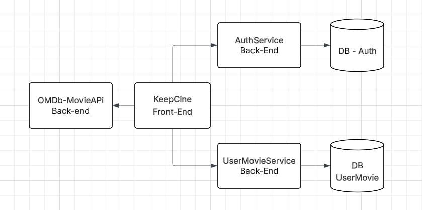
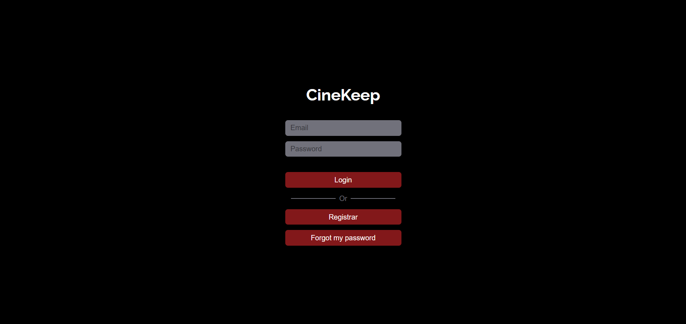

# 🎬 CineKeep 

 

   
  

O CineKeep é uma aplicação desenvolvida para oferecer uma forma prática e personalizada de organizar filmes em uma lista individual. Seu principal objetivo é permitir que cada usuário construa um espaço próprio para registrar e acompanhar os títulos que considera relevantes, mantendo assim um histórico sempre acessível.

Dentro do sistema, é possível pesquisar diferentes obras, consultar informações completas sobre cada filme — como título, sinopse, elenco e ano de lançamento — e salvar aquelas que despertam interesse. Além disso, o usuário pode atribuir uma avaliação numérica a cada título, registrando sua percepção de maneira simples e objetiva.

Essa funcionalidade transforma o KeepCine em uma ferramenta útil para quem deseja manter controle sobre o que já assistiu, acompanhar o que pretende assistir futuramente e comparar suas próprias notas com os filmes que compõem seu histórico pessoal. A ênfase não está em comentários ou discussões, mas na avaliação individual, permitindo que cada pessoa organize sua experiência cinematográfica de forma clara e direta.

Vale ressaltar que a aplicação não possui funcionalidade de reprodução de filmes. Seu foco está totalmente voltado para o gerenciamento e registro das avaliações, garantindo ao usuário uma plataforma leve e intuitiva para administrar sua relação com o cinema.

## 🎯 Propósito

Este projeto foi desenvolvido como parte do programa de **Pós-Graduação em Desenvolvimento Full Stack da PUC Rio**, tendo como objetivo principal a **consolidação prática de conceitos teóricos estudados durante o curso**.

O desenvolvimento dessa aplicação, me permitiu aprimorar as minhas habilidades com as arquiteturas de desenvolvimento de software, implantação de containers atravez do docker e uma maior aprofundamento da ferramenta React

A ideia desse projeto foi simular uma pequena arquitetura de microsserviços, onde cada API é independente e autônoma, ou seja, consegue viver e operar sem depender diretamente dos outros serviços.

## Diagrama



## 🖥️ Interface

### 🔑 Login


### 🏠 Principal


## 🔗 APIs
Para o funcionamento da aplicação, são utilizados os seguintes serviços:

- **[AuthService](https://github.com/ArturRabello/AuthService)** → responsável pela autenticação e gerenciamento de usuários. 
- **[UserMovieService](https://github.com/ArturRabello/UserMovieService)** → responsável por armazenar e gerenciar os filmes avaliados/salvos pelos usuários.
- **[API OMDB](https://www.omdbapi.com/)** → fornece os dados dos filmes. 


## 🚀 Tecnologias

- **React JS** (construído com Vite)
- **Docker** (Container)  
- **Tailwind CSS**  
- **JavaScript**  
- **Google Fonts**  
- **Font Awesome** (ícones)  

## 🛠️ Como utilizar 
### 1️⃣ É necessário que as apis sejam iniciadas
- [AuthService](https://github.com/ArturRabello/AuthService)
- [UserMovieService](https://github.com/ArturRabello/UserMovieService)
- [API OMDB](https://www.omdbapi.com/)

### 2️⃣Clone o repositório:
```bash
git clone https://github.com/ArturRabello/CineKeep.git
```
### 3️⃣ Configure o .env

É necessario colocar a chave da api no **VITE_OMDB_API_KEY**
Caso ainda não tenha [pegue aqui](https://www.omdbapi.com/apikey.aspx).
```
VITE_AUTH_URL=http://localhost:5200
VITE_AUTH_LOGIN_ROUTE=/auth/login
VITE_AUTH_REGISTER_ROUTE=/auth/register
VITE_AUTH_GET_CURRENT_USER_ROUTE=/auth/getCurrentUser
VITE_AUTH_DELETE_USER_ROUTE=/auth/userDelete
VITE_UPDATE_PASSWORD_ROUTE=/auth/updatePassword
VITE_LOGOUT_ROUTE=/auth/logout

# API UserMovie
VITE_USER_MOVIE_URL=http://localhost:5100
VITE_USER_MOVIE_ADD_MOVIE_ROUTE=/movieUser/addMovies
VITE_USER_MOVIE_REMOVE_MOVIE_ROUTE=/movieUser/removeMovies
VITE_USER_MOVIE_SET_SCORE_ROUTE=/movieUser/setScore
VITE_USER_MOVIE_GET_LIST_ROUTE=/movieUser/getList
VITE_USER_MOVIE_GET_VERIFY_MOVIE_ROUTE=/movieUser/verifyMovie
VITE_USER_MOVIE_GET_SCORE_ROUTE=/movieUser/getScore

# API do TMDB
VITE_OMDB_URL=https://www.omdbapi.com/
VITE_OMDB_API_KEY={key da api}
```

### 4️⃣ Executar localmente com NPM

**Instalar as dependencias**
```bash
npm install
```
**Inicie o servidor de desenvolvimento:**
```bash
npm run dev
```

### 5️⃣ Execute em um container Docker
**Será necessario que você tenha o Docker Desktop instalado em sua maquina.**
- [Windows](https://docs.docker.com/desktop/setup/install/windows-install/)
- [Linux](https://docs.docker.com/desktop/setup/install/linux/)
- [Mac](https://docs.docker.com/desktop/setup/install/mac-install/)

**Caso seu sistema operacional seja Windows ou Mac, será necessário instalar o [WSL 2](https://learn.microsoft.com/pt-br/windows/wsl/install)**

#### DockerFile
**Antes de explicarmos o Dockerfile, é importante mencionar que utilizaremos o Nginx para servir a aplicação React em produção.**

O Nginx atua como um servidor web leve e rápido, responsável por entregar os arquivos estáticos gerados pelo build do React, garantindo que a aplicação seja acessível via navegador de forma eficiente e segura. [Saiba mais](https://nginx.org/en/docs/)


**Eu recomendo utilizar esse dockerfile.**
- **Fase de build (builder)**
    - Usa a imagem **Node 20 (alpine)** → leve e otimizada.

    - Define **/app** como diretório de trabalho.

    - Copia os arquivos **package.json** e instala as dependências **(npm ci)**.

    - Copia o restante do código e roda **npm run build** → gera a versão otimizada do React (pasta /build).
- **Fase de produção**
    -  Usa a imagem **Nginx (alpine)** → para servir os arquivos estáticos.
    -  Copia os arquivos gerados no build **(/app/build)** para a pasta do **Nginx** (/usr/share/nginx/html).
    -  Copia a configuração customizada do **Nginx (nginx.conf)**.
    - Expõe a **porta 80**.
    - Sobe o **Nginx em primeiro plano** para rodar a aplicação.
```
FROM node:20-alpine AS builder

WORKDIR /app

COPY package*.json ./

RUN npm ci --only=production=false

COPY . .

RUN npm run build

FROM nginx:alpine

COPY --from=builder /app/build /usr/share/nginx/html

COPY nginx.conf /etc/nginx/nginx.conf

EXPOSE 80

CMD ["nginx", "-g", "daemon off;"]
```

#### Nginx.conf

Esse arquivo configura o Nginx para servir a aplicação React de forma eficiente, garantindo que arquivos estáticos sejam entregues corretamente e que todas as rotas da SPA funcionem mesmo ao recarregar a página.


```
events {
    worker_connections 10;
}

http {
    include /etc/nginx/mime.types;
    default_type application/octet-stream;

    sendfile on;
    keepalive_timeout 65;

    server {
        listen 80;
        server_name localhost;
        root /usr/share/nginx/html;
        index index.html;

    location / {
        try_files $uri $uri/ /index.html;
    }
}
```

#### Docker Compose

O serviço frontend usa o Dockerfile local para construir a imagem da aplicação React, serve a aplicação via Nginx e expõe a porta 3000 no host para acesso pelo navegador.

 - **Service** → Define os serviços que o Docker Compose vai gerenciar.
 - **frontend** → Nome do serviço.
 - **build .** →  Indica que o Docker Compose vai usar o Dockerfile presente na pasta atual (.) para construir a imagem do frontend.
 - **container_name: keepCine** → Nome do container.
 - **ports: "3000:80"** → faz o mapeamento de portas (http://localhost:3000).


```
services:
  frontend:
    build: .
    container_name: keepCine
    ports:
      - "3000:80"
```

#### Construir a imagem e subir o container

**Controi a imagem**
```
docker compose build
```

**Cria containers (se não existirem) e sobe eles. Pode rebuildar imagens se necessário.**

```
docker compose up
```

**Inicia o container**
```
docker compose start
```

## 🔍 funcionalidades
- **🔐 Autenticação com JWT:** O sistema possui um processo de login que utiliza JSON Web Token (JWT) para garantir segurança e confiabilidade. Após a autenticação, um cookie é gerado e enviado ao navegador, permitindo que o usuário navegue de forma autenticada durante toda a sessão.

- **🔗 Integração com a API OMDb:** A aplicação consome dados da API OMDb, possibilitando a pesquisa de filmes em um catálogo amplo e atualizado. Com isso, o usuário pode consultar informações completas de cada título, incluindo título, ano, sinopse, elenco e outros detalhes relevantes.

- **📝 Exibição de informações detalhadas:** Ao acessar um filme pesquisado, o sistema apresenta suas informações de maneira organizada e acessível, oferecendo ao usuário uma visão geral antes de decidir adicioná-lo à sua lista.

- **📂 Criação de lista pessoal de filmes:** O usuário pode adicionar filmes pesquisados a uma lista própria, vinculada à sua conta. Essa lista funciona como um histórico individual, permitindo que cada pessoa organize e gerencie os títulos de acordo com suas preferências.

- **⭐ Avaliação por estrelas:** Cada filme adicionado à lista pode receber uma nota de 1 a 5 estrelas, atribuída pelo usuário. Esse sistema de classificação é simples e intuitivo, permitindo registrar rapidamente a impressão pessoal sobre cada obra.


## 📂 Estrutra do projeto

```
📦 Keep-Cine
├── 📂 public/              # 📜 Arquivos estáticos públicos
├── 📂 src/                 # 💻 Código-fonte principal
│   ├── 🌐 api/             # 🔗 Configuração e chamadas de API
│   ├── 🖼️ assets/          # 🖌️ Imagens e outros arquivos estáticos
│   ├── 🧩 components/      # 🛠️ Componentes reutilizáveis
│   ├── 🌍 context/         # 🧠 Context API (estado global)
│   ├── 📐 Layout/          # 🎨 Estruturas de layout (header, footer, etc.)
│   ├── 📑 pages/           # 📄 Páginas da aplicação
│   ├── 🛣️ route/           # 🗺️ Configuração das rotas
│   ├── ⚙️ services/        # 🔒 Serviços auxiliares (auth, utilitários)
│   ├── ⚛️ App.jsx          # 🌟 Componente raiz
│   ├── 🎨 App.css          # 🎭 Estilos globais do App
│   ├── 🎨 index.css        # 🎭 Estilos globais base
│   └── 🚀 main.jsx         # 🏁 Ponto de entrada da aplicação
│
├── 🐳 docker-compose.yml   # ⚙️ Configuração do Docker Compose
├── 🐳 dockerfile           # 📦 Dockerfile para build e deploy
├── 📝 nginx.conf           # 🌐 Configuração do Nginx
├── 📦 package.json         # 📋 Dependências e scripts do projeto
├── ⚡ vite.config.js       # ⚙️ Configuração do Vite
└── 📘 README.md            # 📖 Documentação do projeto


```